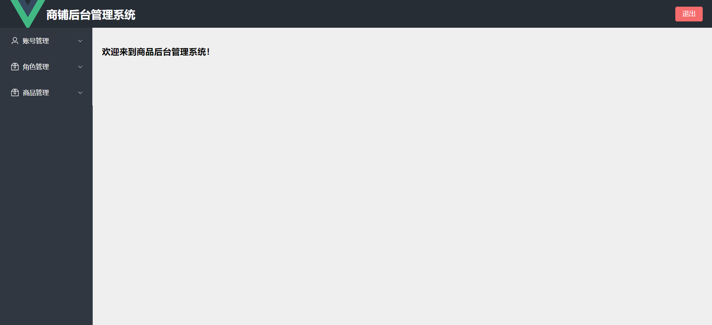
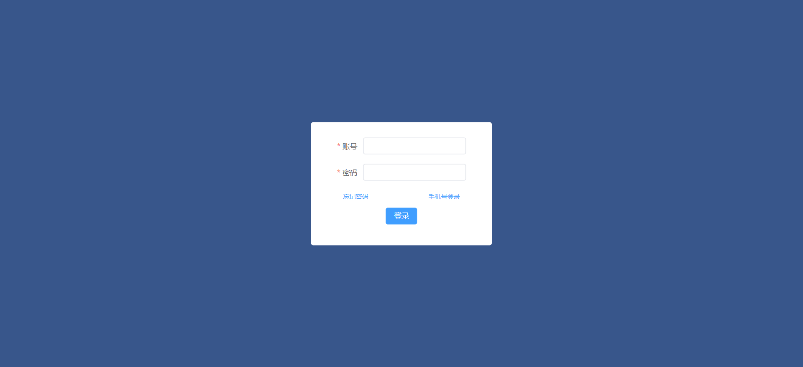
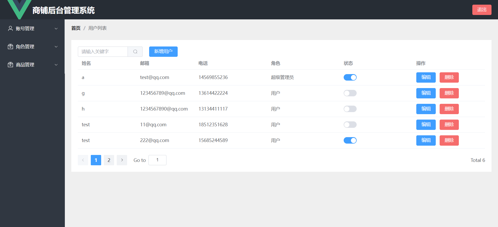
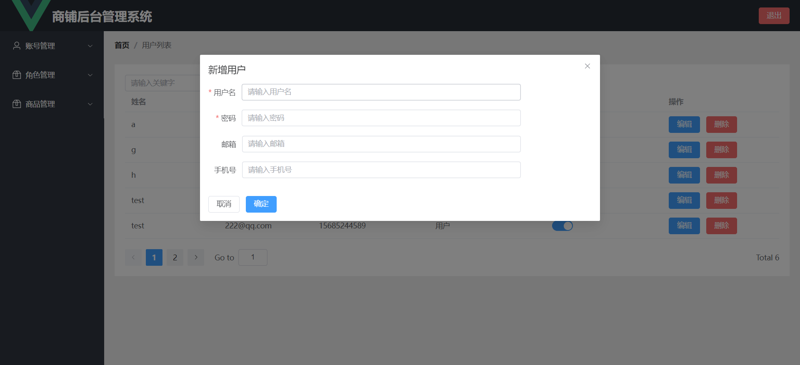
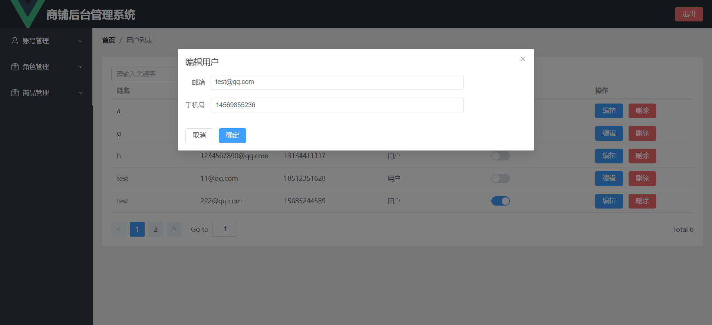
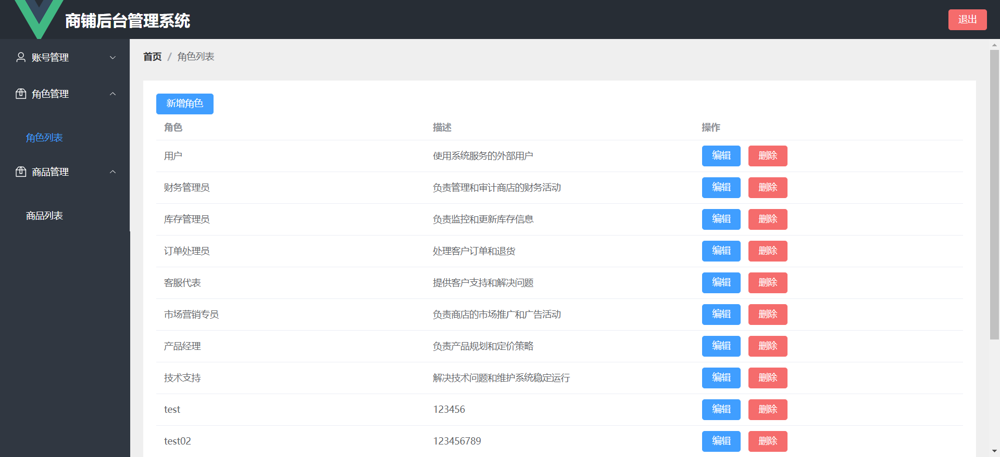
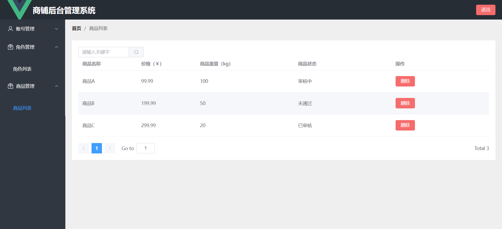

# 商品后台管理系统

这是一个用于学习vue3的项目，主要是为了熟悉vue3的新特性，以及熟悉vue3的项目开发流程。

## 项目简介

本项目是一个基于Vue3、python的前后端分离的商品后台管理系统项目，用于管理商品信息。项目使用了Vue Router进行路由管理。项目还使用了Element Plus组件库，用于快速构建UI界面。

前端：采用组件化、单页面应用、状态管理的思想，使用Vue3进行开发，使用Element Plus组件库快速构建UI界面。

后端：采用Python Flask框架进行开发，使用Flask-RESTful扩展实现RESTful API，使用模块化设计，使得代码结构更加清晰，便于维护和扩展。

## 效果图









## 当前版本

- Vue 3.2.13
- Python 3.11.5
- npm 10.5.0
- MySQL 8.0.36

## 编译&安装

```bash
# 克隆项目
git clone https://github.com/AlcMaple/shop.git

# 迁移数据库
# 在python/register.py文件中修改数据库连接信息
# 手动创建MySQL数据库，用于保存迁移的数据库

mysql -u your_local_user -p your_local_database < shop.sql

# 启动后端
cd shop/python

# 安装依赖
pip install -r requirements.txt

# 启动后端服务
python main.py

# 启动前端
cd shop
npm install
npm run server

# 访问项目
http://localhost:8080/

# 默认账号：test 默认密码：123456
```

## 功能介绍

- 商品列表：展示所有商品信息，包括商品名称、价格、重量等。
- 商品查询：根据商品名称查询商品信息。
- 商品编辑：编辑已存在的商品信息，包括商品名称、价格、库存等。
- 商品删除：删除已存在的商品信息。
- 用户列表：展示所有用户信息，包括用户名、邮箱、电话等。
- 用户添加：添加新的用户信息，包括用户名、邮箱、密码等。
- 用户编辑：编辑已存在的用户信息，包括手机号、邮箱等。
- 用户删除：删除已存在的用户信息。
- 角色列表：展示所有用户信息，包括角色名、描述等。
- 角色添加：添加新的用户信息，包括角色名、描述等。
- 角色编辑：编辑已存在的用户信息，包括角色名、描述等。
- 角色删除：删除已存在的用户信息。
- 分页查询：分页查询商品信息、用户信息、角色信息。

## 项目特性

采用了模块化的思想，将功能模块化，使得代码结构更加清晰，便于维护和扩展，用户可以根据自己的需求进行二次开发，添加新的模块或修改现有的模块。

## 感谢

- 所有开源软件组织&开发者